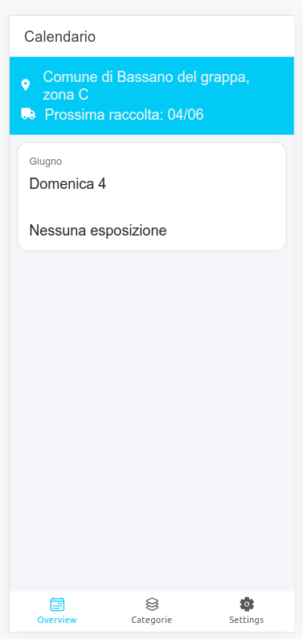
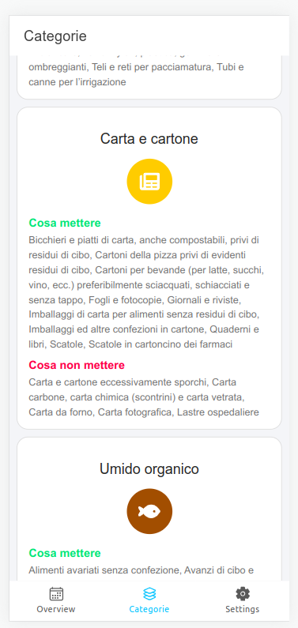

# Waster app
 
App raccolta differenziata per il comune di Bassano del grappa. La lista dei comuni disponibili la trovi nel menù di selezione del branch.




## Installation

It's advisable to use YARN

### 1 Install dependencies
```sh
yarn
```

### 2 Install platform support

For example, to add android support
```sh
npx cap add android
```

For more information, see https://capacitorjs.com/docs

## Dev environment

Puoi avviare l'applicazione in due modalità:

### Dev environment

In this mode, the application will be run by the browser and you can develop the entire client-side like any other frontend project. However, you will not be able to run capacitor code.

```sh
yarn dev
```

### Native Dev environment

In this mode, the application will be run by a specific IDE for the supported platform. In the case of an Android platform, an instance of Android Studio with your project compiled in native language will be opened. From there, you can simulate the app using capacitor and compile a final `apk`.

```sh
yarn native-dev
```